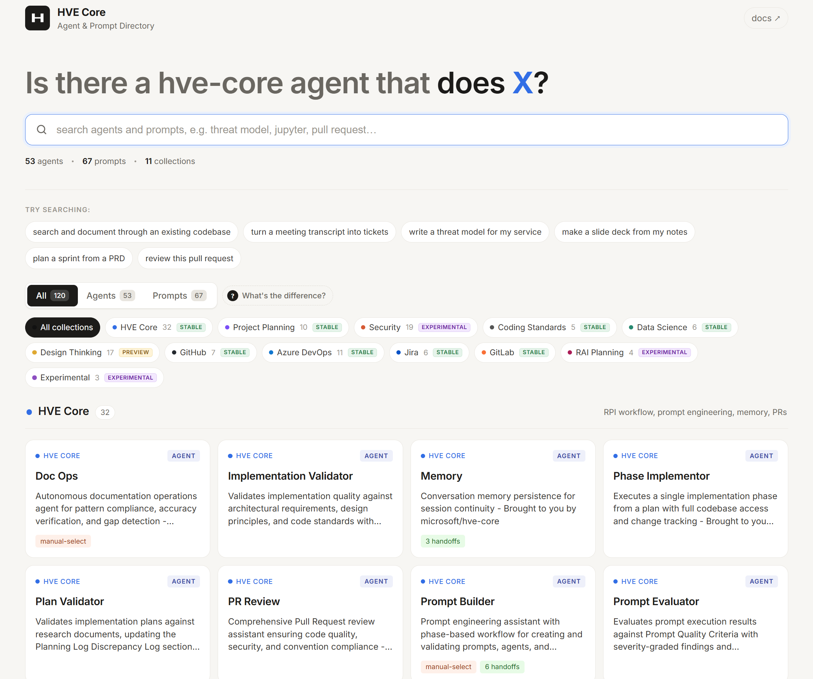

# HVE Detective

[](https://github.com/AmieDD/HVE-Detective/actions/workflows/deploy.yml)
[](https://github.com/AmieDD/HVE-Detective/actions/workflows/sync-catalog.yml)
[](https://github.com/AmieDD/HVE-Detective/actions/workflows/sync-catalog.yml)

Searchable directory of HVE Core Copilot agents and prompts.

**Live site:** <https://amiedd.github.io/HVE-Detective/>



## Features

- Fuzzy search powered by Fuse.js
- Collection filters for browsing by source package
- Kind filters to narrow results by agent, prompt, or instruction type
- Detail drawer with full metadata and descriptions
- Responsive design for desktop and mobile

## Local Development

```bash
npm install
npm run dev
```

## Build

```bash
npm run build
npm run preview
```

## Deployment

Auto-deploys to GitHub Pages via GitHub Actions on every push to `main`.

## Catalog Sync

The searchable catalog is generated from [`microsoft/hve-core`](https://github.com/microsoft/hve-core) releases by [`.github/workflows/sync-catalog.yml`](.github/workflows/sync-catalog.yml). No manual editing of `src/data/catalog.json` is required when upstream changes.

| Aspect          | Behavior                                                                                            |
|-----------------|-----------------------------------------------------------------------------------------------------|
| Schedule        | Every 6 hours (`cron: '0 */6 * * *'`)                                                               |
| Manual trigger  | `workflow_dispatch` from the Actions tab                                                            |
| Event trigger   | `repository_dispatch` of type `hve-core-release` (optional `client_payload.tag` short-circuits scan) |
| Source release  | Highest-versioned non-draft tag matching `hve-core-vMAJOR.MINOR.PATCH`                              |
| Packages merged | 12 per-collection VSIXes (for example, `hve-core`, `hve-coding-standards`, `hve-security`)          |
| Supply chain    | Each VSIX verified with `gh attestation verify -R microsoft/hve-core` before extraction             |
| Output          | PR on branch `chore/sync-hve-core` updating only `src/data/catalog.json`, awaiting maintainer merge |

Once the PR merges to `main`, the Pages deploy workflow publishes the refreshed catalog to <https://amiedd.github.io/HVE-Detective/>.

For sync failures and manual recovery commands, see [docs/SYNC.md](docs/SYNC.md).

## Technology Stack

| Tool                 | Version | Purpose                                              |
|----------------------|---------|------------------------------------------------------|
| Vite                 | 6       | Dev server and build tool                            |
| React                | 18      | UI framework                                         |
| React DOM            | 18      | React renderer for the browser                       |
| Fuse.js              | 7       | Fuzzy search over the catalog                        |
| @vitejs/plugin-react | 4       | React Fast Refresh and JSX support for Vite          |
| gray-matter          | 4       | YAML frontmatter parsing in the catalog generator    |
| Node.js              | 20      | Runtime for `scripts/generate-catalog.mjs` and CI    |
| GitHub Actions       | n/a     | CI/CD: deploy to GitHub Pages, catalog sync, CodeQL  |
| CodeQL               | v3      | Code scanning on push/PR to `main`                   |

## License

[MIT](LICENSE)
