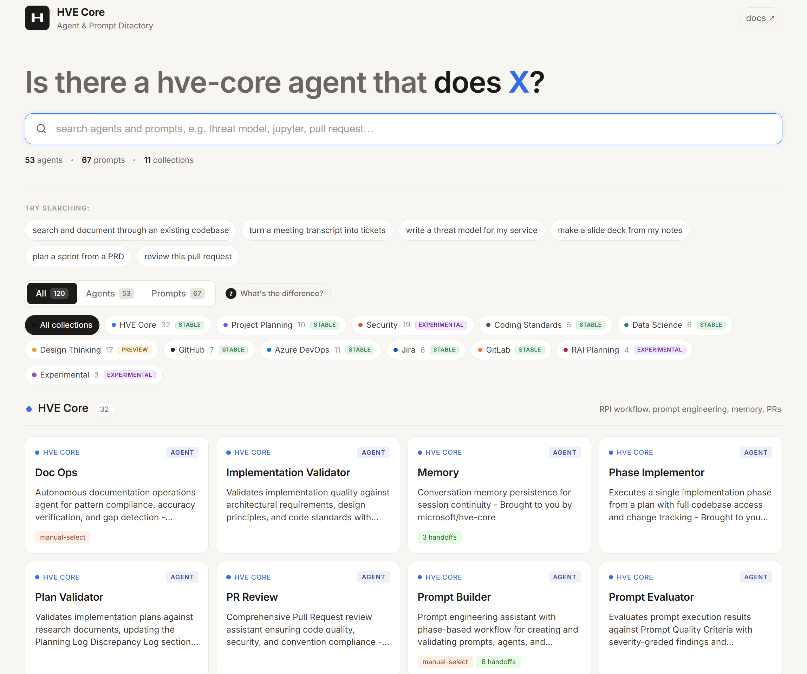

# HVE Detective

[](https://github.com/AmieDD/HVE-Detective/actions/workflows/deploy.yml)
[](https://github.com/AmieDD/HVE-Detective/actions/workflows/sync-catalog.yml)
[](https://github.com/AmieDD/HVE-Detective/actions/workflows/sync-catalog.yml)

Searchable directory of HVE Core Copilot agents, prompts, and skills.

**Live site:** <https://amiedd.github.io/HVE-Detective/>



## Features

- Fuzzy search powered by Fuse.js
- Collection filters for browsing by capability area
- Kind filters to narrow results to agents, prompts, or skills
- Skills labelled as slash commands or as background skills that Copilot loads automatically
- Detail drawer with full metadata, invocation guidance, and a link to the upstream source file
- Responsive design for desktop and mobile

## Local Development

```bash
npm install
npm run dev
```

## Build

```bash
npm run build
npm run preview
```

## Deployment

Auto-deploys to GitHub Pages via GitHub Actions on every push to `main`.

## Syncing from hve-core

The directory data in `src/data/catalog.json` is generated from
[microsoft/hve-core](https://github.com/microsoft/hve-core). Do not edit it by hand.

### Regenerate locally

```bash
git clone --depth 1 https://github.com/microsoft/hve-core.git ../hve-core
npm run catalog:sync -- --source ../hve-core
```

The generator takes the agents, prompts, and skills listed in hve-core's `plugin.json`, reads their
frontmatter, and records the upstream commit in the catalog. It prints a summary of added, removed,
and changed items. Options:

- `--ref <name>` records the upstream branch or tag name (defaults to the checkout's branch).
- `--summary <file>` also writes the summary as Markdown.
- `--allow-shrink` accepts a catalog that is less than 70% of the previous item count.

The run fails without touching the catalog when a listed file is missing, a listed path points
outside the checkout, an item has no description, the total shrinks sharply, or an item belongs to a
capability area that has no entry in `src/data/collectionMeta.js`. For a new area, add a label,
color, and note to `COLLECTION_META` and `COLLECTION_ORDER`, then rerun. The summary also lists
keyword hints in `src/data/keywordHints.js` that no longer match any item.

### Weekly sync workflow

`.github/workflows/sync-catalog.yml` runs every Monday and can be started manually from the Actions
tab (optionally with a different hve-core branch or tag). It regenerates the catalog from hve-core
`main`, builds the site, and, when the catalog changed, opens or updates a single pull request from
the `catalog-sync/hve-core` branch. Merging that pull request deploys the site. The workflow only runs
from `main`.

One-time setup: enable **Settings > Actions > General > Workflow permissions > Allow GitHub Actions to
create and approve pull requests**. Without it the workflow cannot open pull requests.

After the workflow first reaches `main`, confirm it end to end:

1. Run it manually and note whether it opens a pull request or reports that the catalog is unchanged.
2. While a sync pull request is open, run it again and confirm the same pull request is updated.
3. Record a run that reports no change (for example, when hve-core has not moved since the last merge).
4. Push a scratch branch that contains the workflow, run it against that branch, confirm the job is
   skipped, then delete the branch.

## Technology Stack

| Tool                 | Version | Purpose                                              |
|----------------------|---------|------------------------------------------------------|
| Vite                 | 6       | Dev server and build tool                            |
| React                | 18      | UI framework                                         |
| React DOM            | 18      | React renderer for the browser                       |
| Fuse.js              | 7       | Fuzzy search over the catalog                        |
| @vitejs/plugin-react | 4       | React Fast Refresh and JSX support for Vite          |
| yaml                 | 2       | YAML frontmatter parsing in the catalog generator    |
| Node.js              | 20      | Runtime for `scripts/build-catalog.mjs` and CI       |
| GitHub Actions       | n/a     | CI/CD: deploy to GitHub Pages, catalog sync, CodeQL  |
| CodeQL               | v3      | Code scanning on push/PR to `main`                   |

## Content Attribution

Names, descriptions, and outlines in the directory are excerpted from
[microsoft/hve-core](https://github.com/microsoft/hve-core), © Microsoft Corporation, under the MIT
License. Some skills declare Creative Commons or other licenses; each skill's license is shown in the
directory. The exact upstream commit is recorded in the catalog and linked from the site footer. See
[THIRD-PARTY-NOTICES.md](THIRD-PARTY-NOTICES.md) for details.

## License

[MIT](LICENSE)
